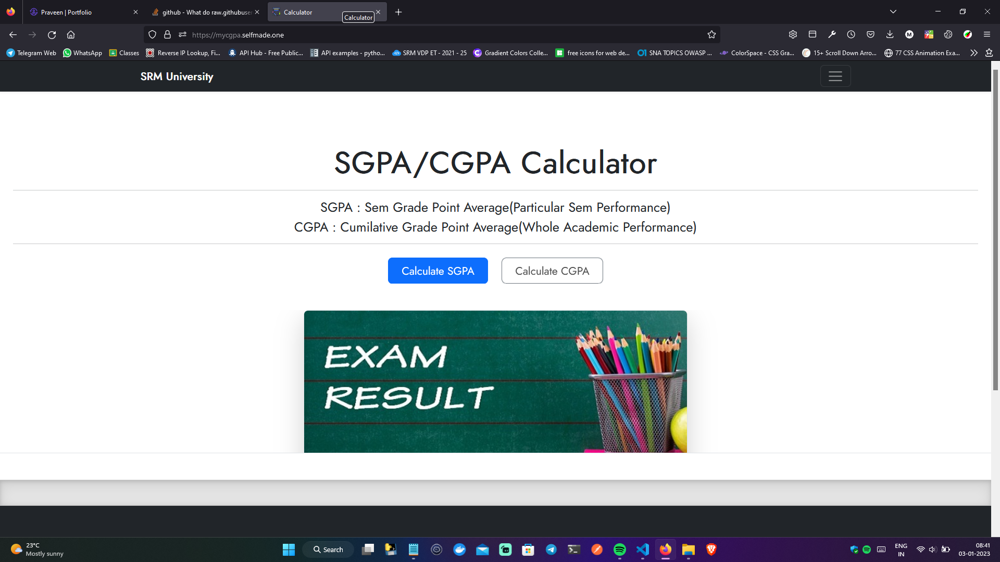

# CGPS/SGPA Calculator 


## Appendix

CGPA/SGPA calculator is a web app used to calculate CGPA or Sgpa of an engineering student for Per Semester or the whole academic

## Languages Used

Languages used in this project are :

- html
- css
- Php
- Javascript

## Services Used


## Tech Stack

**Client:** Bootstrap


## Screenshots




## Deployed at

```javascript
https://mycgpa.selfmade.one/
```

